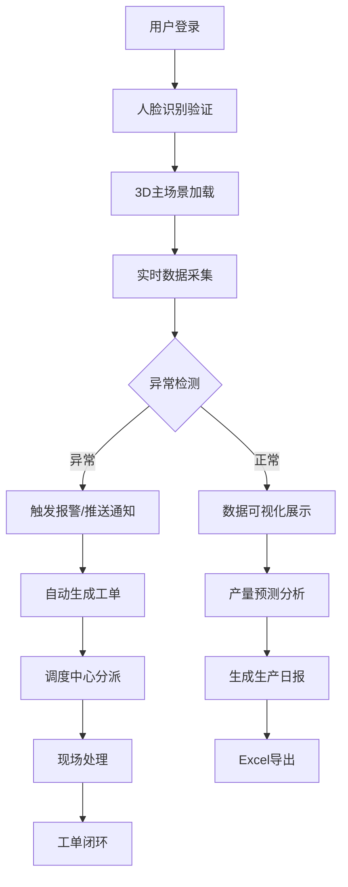

## 1. 产品概述

3D智慧油田采油与管网调度可视化平台是一个基于三维可视化技术的油田生产监控与调度管理系统。系统通过沉浸式3D场景实时展示采油井、计量站、联合站、输油管线、注水井等核心设施的运行状态，集成智能预警、故障诊断、产量预测、环保监测等功能，为油田生产管理提供智能化决策支持。

- **目标用户**：采油工、井队长、生产厂长、调度人员、应急管理团队
- **核心价值**：提升生产管理效率、降低设备故障率、减少安全环保风险、优化产能配置

## 2. 核心功能

### 2.1 用户角色与权限

| 角色 | 登录方式 | 核心权限 |
|------|----------|----------|
| 采油工 | 人脸识别 | 查看所负责油井数据，上报设备状态，接收工单 |
| 队长 | 人脸识别 | 管辖区域全部数据查看，工单分派，调参审批 |
| 厂长 | 人脸识别 | 全油田数据总览，生产报表查看，重大决策审批 |

### 2.2 功能模块

1. **3D场景可视化**：采油井、计量站、联合站、输油管线、注水井、调度中心三维展示
2. **油井实时监控**：井号、产液量、含水率、动液面、泵效数据展示，24小时曲线查询
3. **智能预警系统**：泵效异常、含水率突增、管线泄漏、压力异常、环保超标报警
4. **设备运维管理**：自动生成检修工单，修井队调度，故障记录跟踪
5. **环保监测**：硫化氢、甲烷浓度监测，声光报警，应急通知推送
6. **产量预测分析**：基于历史数据预测未来7天单井产量，低产井识别与增产建议
7. **调度指挥中心**：生产日报生成，Excel导出，操作日志记录

### 2.3 页面详情

| 页面名称 | 模块名称 | 功能描述 |
|----------|----------|----------|
| 登录页 | 人脸识别登录 | 摄像头采集人脸，验证身份，记录登录日志 |
| 3D主场景 | 油田全景 | 可旋转缩放的3D油田场景，所有设施可视化展示 |
| 油井详情面板 | 单井监控 | 产液量、含水率、动液面、泵效实时数据，24小时产油曲线和功图 |
| 报警中心 | 预警列表 | 所有异常报警集中展示，按级别分类，可确认和处理 |
| 调度中心 | 工单管理 | 检修工单、抢修工单派发与跟踪，修井队位置显示 |
| 报表中心 | 生产日报 | 按日期查询生产数据，Excel导出功能 |
| 环保监测 | 实时监测 | 硫化氢、甲烷浓度实时显示，超标报警与应急联动 |
| 产量预测 | 智能分析 | 未来7天产量预测曲线，低产井高亮，增产措施建议 |

## 3. 核心流程

### 3.1 主要业务流程

用户通过人脸识别登录系统后，进入3D主场景查看油田整体运行态势。点击任意设施可查看详细数据。当系统检测到异常（如泵效低于30%、含水率突增、管线压力突降、环保指标超标等），会自动触发报警，推送通知给相关人员，并生成对应工单。调度人员可在调度中心分派工单，跟踪处理进度。系统每日自动生成生产日报，支持按日期导出Excel。

### 3.2 流程图

## 4. 用户界面设计

### 4.1 设计风格

- **主色调**：深蓝色（#0A1628）为背景主色，科技蓝（#00D4FF）为强调色，橙色（#FF8C00）为警告色，红色（#FF3B30）为报警色，绿色（#34C759）为正常状态色
- **设计风格**：工业科技风，深色主题，赛博朋克元素，数据仪表盘风格
- **按钮样式**：圆角矩形，渐变边框，悬停发光效果
- **字体**：标题使用 Orbitron（科技感字体），正文使用 Noto Sans SC（清晰易读）
- **布局风格**：3D场景居中，侧边信息面板悬浮，顶部导航栏，底部状态栏
- **图标风格**：线性图标，科技感线条风格

### 4.2 页面设计概览

| 页面名称 | 模块名称 | UI元素 |
|----------|----------|--------|
| 登录页 | 人脸识别 | 摄像头窗口、科技感登录框、动态背景粒子效果 |
| 3D主场景 | 油田全景 | 三维油田模型、可交互设施、信息悬浮标签、报警高亮效果 |
| 油井详情 | 数据面板 | 数据卡片、折线图、功图展示、状态指示灯 |
| 报警中心 | 列表面板 | 分级报警卡片、时间轴、确认/处理按钮 |
| 调度中心 | 工单看板 | 工单卡片、人员位置、进度条、地图标注 |
| 报表中心 | 数据表格 | 可筛选表格、图表、导出按钮 |
| 环保监测 | 仪表盘 | 仪表盘组件、浓度曲线、报警指示灯 |
| 产量预测 | 分析面板 | 预测曲线、低产井高亮、措施建议卡片 |

### 4.3 响应式设计

- 以桌面端为主（1920×1080及以上），适配大屏展示
- 侧边面板可折叠，适配不同分辨率
- 3D场景自适应窗口大小

### 4.4 3D场景设计

- **环境**：荒漠/戈壁油田环境，HDRI环境贴图，昼夜变化效果
- **光照**：主方向光模拟阳光，辅助光突出设施轮廓，报警时红色闪烁光
- **相机**：默认俯视视角，支持轨道控制器，可设置预设视角快速切换
- **交互**：点击设施选中高亮，鼠标悬停显示简要信息，双击进入详情
- **动画**：抽油机上下往复运动，管线流体流动效果，报警时闪烁动画
- **后期处理**：Bloom发光效果，轻微颗粒感，提升科技感
