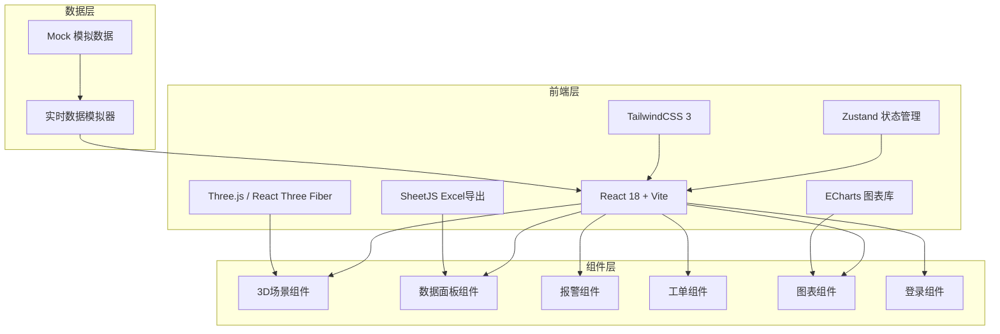

## 1. 架构设计



## 2. 技术描述

- **前端框架**：React@18 + Vite@5
- **3D引擎**：three@0.160 + @react-three/fiber@8 + @react-three/drei@9 + @react-three/postprocessing@2
- **状态管理**：zustand@4
- **样式框架**：tailwindcss@3
- **图表库**：echarts@5 + echarts-for-react@3
- **Excel导出**：xlsx@0.18
- **图标**：lucide-react@0.29
- **路由**：react-router-dom@6
- **后端**：无后端，使用Mock数据模拟实时数据流
- **数据持久化**：localStorage存储用户偏好和操作日志

## 3. 路由定义

| 路由 | 页面 | 用途 |
|------|------|------|
| /login | 登录页 | 人脸识别登录界面 |
| / | 3D主场景 | 油田全景3D可视化主界面 |
| /well/:id | 油井详情 | 单油井详细数据和曲线 |
| /alarms | 报警中心 | 所有报警信息列表和处理 |
| /dispatch | 调度中心 | 工单管理和调度 |
| /reports | 报表中心 | 生产日报查询和导出 |
| /environment | 环保监测 | 硫化氢、甲烷实时监测 |
| /forecast | 产量预测 | 产量预测和增产建议 |

## 4. 数据模型

### 4.1 核心数据结构

```typescript
// 油井数据
interface OilWell {
  id: string;
  wellNumber: string;
  name: string;
  position: { x: number; y: number; z: number };
  productionRate: number;      // 产液量 m³/d
  waterCut: number;            // 含水率 %
  dynamicFluidLevel: number;   // 动液面 m
  pumpEfficiency: number;      // 泵效 %
  status: 'normal' | 'warning' | 'alarm' | 'maintenance';
  h2sLevel: number;            // 硫化氢浓度 ppm
  ch4Level: number;            // 甲烷浓度 %LEL
  productionHistory: { time: string; value: number }[];
  dynamometerCard: number[];   // 功图数据
}

// 计量站
interface MeteringStation {
  id: string;
  name: string;
  position: { x: number; y: number; z: number };
  totalLiquid: number;
  avgWaterCut: number;
  connectedWells: string[];
  status: 'normal' | 'warning' | 'alarm';
}

// 联合站
interface UnionStation {
  id: string;
  name: string;
  position: { x: number; y: number; z: number };
  separators: Separator[];
  status: 'normal' | 'warning' | 'alarm';
}

// 分离器
interface Separator {
  id: string;
  name: string;
  liquidLevel: number;
  pressure: number;
  maxLevel: number;
  isActive: boolean;
  isStandby: boolean;
}

// 输油管线
interface Pipeline {
  id: string;
  name: string;
  startPoint: { x: number; y: number; z: number };
  endPoint: { x: number; y: number; z: number };
  length: number;
  pressurePoints: PressurePoint[];
  status: 'normal' | 'leak' | 'warning';
}

// 压力监测点
interface PressurePoint {
  id: string;
  position: number;           // 距离起点 km
  pressure: number;           // MPa
  isLeak: boolean;
}

// 注水井
interface InjectionWell {
  id: string;
  name: string;
  position: { x: number; y: number; z: number };
  injectionPressure: number;
  injectionRate: number;
  status: 'normal' | 'warning' | 'alarm';
}

// 报警
interface Alarm {
  id: string;
  type: 'pump' | 'waterCut' | 'leak' | 'pressure' | 'h2s' | 'ch4' | 'level';
  level: 'warning' | 'danger' | 'critical';
  targetId: string;
  targetName: string;
  message: string;
  timestamp: string;
  status: 'pending' | 'confirmed' | 'resolved';
  workOrderId?: string;
}

// 工单
interface WorkOrder {
  id: string;
  type: 'maintenance' | 'repair' | 'emergency';
  targetId: string;
  targetName: string;
  description: string;
  assignedTeam: string;
  status: 'pending' | 'inProgress' | 'completed';
  createdAt: string;
  completedAt?: string;
}

// 用户
interface User {
  id: string;
  name: string;
  role: 'worker' | 'leader' | 'manager';
  lastLogin: string;
}

// 产量预测
interface ProductionForecast {
  wellId: string;
  wellName: string;
  historicalData: { date: string; value: number }[];
  forecastData: { date: string; value: number }[];
  isLowProduction: boolean;
  suggestion: string;
}
```

### 4.2 数据模拟方案

- 使用 setInterval 模拟实时数据更新（每3秒更新一次）
- 数据在一定范围内随机波动，模拟真实生产场景
- 随机触发异常事件，测试报警和工单系统
- 产量预测使用简单的递减算法模拟

## 5. 核心组件结构

```
src/
├── components/
│   ├── 3d/
│   │   ├── OilFieldScene.tsx      # 主3D场景
│   │   ├── OilWellModel.tsx       # 采油井模型
│   │   ├── MeteringStationModel.tsx # 计量站模型
│   │   ├── UnionStationModel.tsx  # 联合站模型
│   │   ├── PipelineModel.tsx      # 输油管线
│   │   ├── InjectionWellModel.tsx # 注水井模型
│   │   └── LeakMarker.tsx         # 泄漏点标记
│   ├── layout/
│   │   ├── Header.tsx             # 顶部导航
│   │   ├── Sidebar.tsx            # 侧边栏
│   │   └── StatusBar.tsx          # 底部状态栏
│   ├── panels/
│   │   ├── WellDetailPanel.tsx    # 油井详情面板
│   │   ├── AlarmPanel.tsx         # 报警面板
│   │   ├── DispatchPanel.tsx      # 调度面板
│   │   ├── EnvironmentPanel.tsx   # 环保监测面板
│   │   └── ForecastPanel.tsx      # 产量预测面板
│   ├── charts/
│   │   ├── ProductionChart.tsx    # 产量曲线图
│   │   ├── DynamometerChart.tsx   # 功图
│   │   └── GaugeChart.tsx         # 仪表盘组件
│   └── common/
│       ├── DataCard.tsx           # 数据卡片
│       ├── AlarmBadge.tsx         # 报警标记
│       └── Modal.tsx              # 弹窗组件
├── store/
│   ├── useOilFieldStore.ts        # 油田数据store
│   ├── useAlarmStore.ts           # 报警store
│   ├── useUserStore.ts            # 用户store
│   └── useWorkOrderStore.ts       # 工单store
├── mock/
│   ├── data.ts                    # 模拟数据
│   └── simulator.ts               # 数据模拟器
├── pages/
│   ├── Login.tsx                  # 登录页
│   ├── MainScene.tsx              # 主场景页
│   ├── AlarmCenter.tsx            # 报警中心
│   ├── DispatchCenter.tsx         # 调度中心
│   ├── ReportCenter.tsx           # 报表中心
│   ├── EnvironmentMonitor.tsx     # 环保监测
│   └── ProductionForecast.tsx     # 产量预测
├── types/
│   └── index.ts                   # 类型定义
├── utils/
│   ├── excel.ts                   # Excel导出工具
│   └── date.ts                    # 日期工具
├── App.tsx
├── main.tsx
└── index.css
```

## 6. 关键技术实现

### 6.1 3D场景实现
- 使用 @react-three/fiber 声明式创建Three.js场景
- 使用 drei 提供的 OrbitControls、Text、Html 等辅助组件
- 抽油机动画使用 useFrame hook 实现往复运动
- 管线使用 TubeGeometry 实现，流动效果使用纹理动画
- 后期处理使用 EffectComposer + BloomPass 实现发光效果

### 6.2 实时数据模拟
- 数据模拟器每3秒更新一次所有设施数据
- 每个数据指标在合理范围内随机波动
- 按一定概率触发异常事件（泵效下降、含水率突增等）
- 使用 Zustand 管理全局状态，状态变化自动触发UI更新

### 6.3 报警机制
- 数据更新时自动检测异常条件
- 泵效 < 30% → 红色报警 + 检修工单
- 含水率突增 > 5% → 橙色警告 + 调参建议
- 管线压力突降 → 泄漏定位 + 抢修工单
- 硫化氢/甲烷超标 → 红色报警 + 声光效果 + 应急通知

### 6.4 Excel导出
- 使用 xlsx 库生成Excel文件
- 包含各油井产量、含水率、设备故障、环保事件统计
- 支持按日期范围筛选导出
